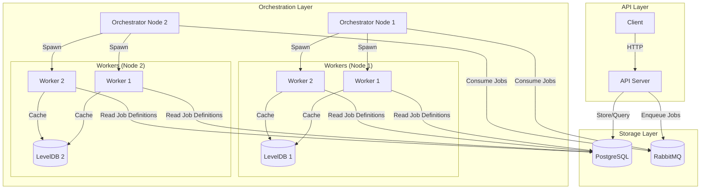

# Naxos
---

Fawad Mazhar <fawadmazhar@hotmail.com> 2024

---

## Architecture

```mermaid
flowchart TB
    subgraph "API Layer"
        client[Client]
        api[API Server]
    end

    subgraph "Storage Layer"
        pg[(PostgreSQL)]
        rmq[(RabbitMQ)]
    end

    subgraph "Orchestration Layer"
        orch1[Orchestrator Node 1]
        orch2[Orchestrator Node 2]
        
        subgraph "Workers (Node 1)"
            w1[Worker 1]
            w2[Worker 2]
            ldb1[(LevelDB 1)]
        end
        
        subgraph "Workers (Node 2)"
            w3[Worker 1]
            w4[Worker 2]
            ldb2[(LevelDB 2)]
        end
    end

    client -->|HTTP| api
    api -->|Store/Query| pg
    api -->|Enqueue Jobs| rmq
    
    orch1 -->|Spawn| w1
    orch1 -->|Spawn| w2
    orch2 -->|Spawn| w3
    orch2 -->|Spawn| w4
    
    w1 & w2 -->|Cache| ldb1
    w3 & w4 -->|Cache| ldb2
    
    orch1 & orch2 -->|Consume Jobs| rmq
    w1 & w2 & w3 & w4 -->|Read Job Definitions| pg
```